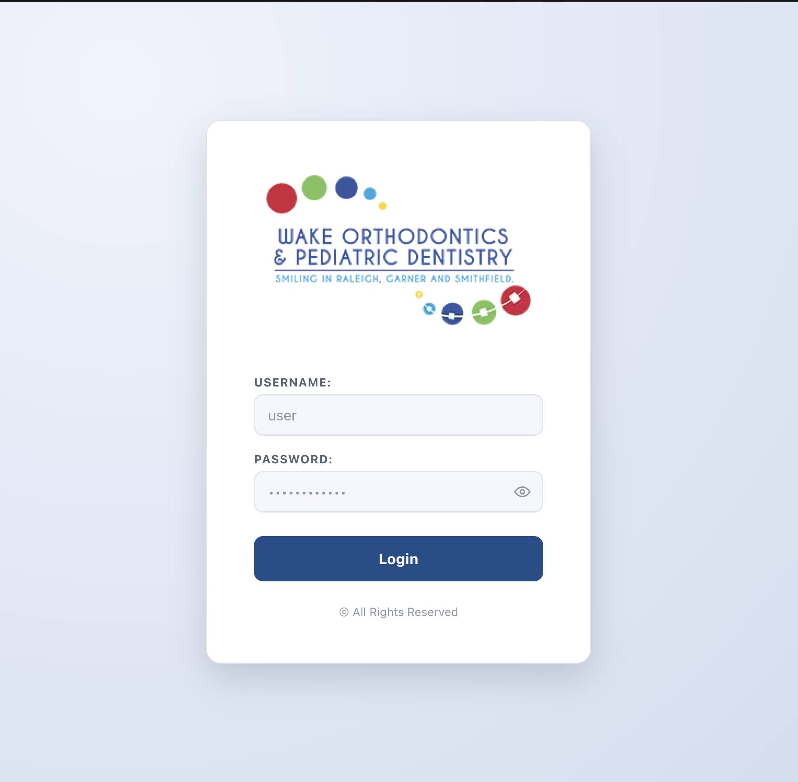
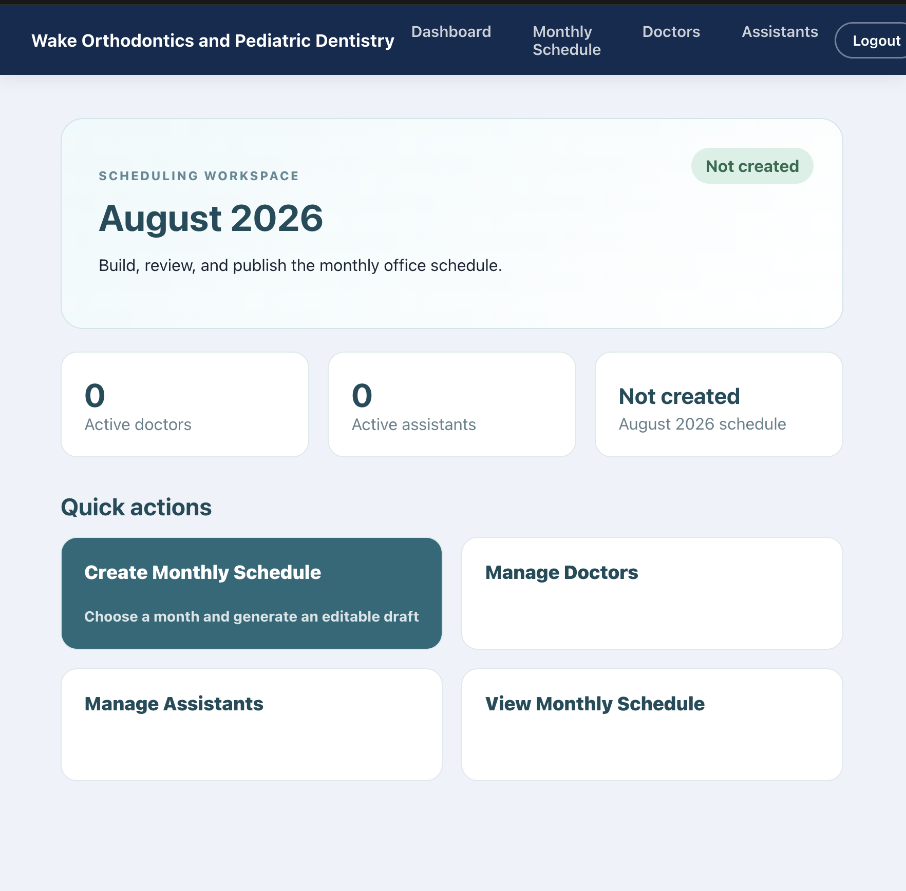
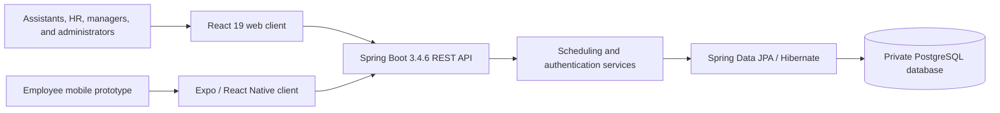
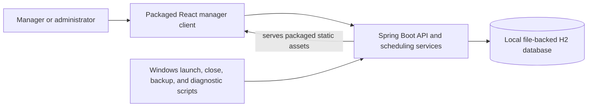

# DentalWave

**A multi-role scheduling and employee-workflow platform built around the real constraints of a multi-location dental practice.**

DentalWave's overall design connects assistants, HR staff, managers, and administrators around employee records, availability, time-off requests, notifications, and monthly schedules. The main application is designed around a React client, Spring Boot API, and a private PostgreSQL database configured outside source control.

The `portable-h2-database` branch explores a possible alternative to that main design: a smaller manager-focused edition that packages the application for local Windows use and replaces the external database requirement with file-backed H2 storage.

> **Project status:** Functional portfolio/capstone project with multiple design variants. This README presents the main multi-role system as the overall product design and documents the portable H2 edition as an experimental branch. The automated results below were verified against the current portable checkout; neither variant should be treated as a production release.

## Overview

### Overall application design

The main DentalWave design is the broader PostgreSQL-backed platform. Its domain model, API, and role-specific interfaces support four application authorities:

- `ROLE_ASSISTANT` for an employee's own published schedule, profile, notifications, and time-off requests.
- `ROLE_HR` for employee administration and time-off review.
- `ROLE_MANAGER` for monthly calendar generation, editing, publishing, and printing.
- `ROLE_ADMIN` for protected user administration and full operational access.

The backend enforces ownership restrictions on employee-specific resources; for example, assistants can access their own requests and notifications rather than other employees' private records.

### Portable H2 alternative

The current `portable-h2-database` checkout substantially adapts the main application for a different deployment constraint. Its active React router and login flow expose only manager and administrator scheduling workflows. Doctors and assistants can be stored as lightweight scheduling resources without login accounts, the built frontend is served from the Spring Boot JAR, and portable mode stores data in an H2 file beside the application.

This branch is a possible deployment and scope alternative—not a replacement for the full application on `main`. The broader multi-role code remains present because the portable work was built from the same platform.

## The Problem

Creating a dental-office schedule is more than placing names on a calendar:

- A practice may operate at several locations.
- Assistants, HR staff, and managers need different views and permissions.
- Employee availability and time-off decisions affect scheduling work.
- Each doctor can work different weekdays and offices.
- Some doctor assignments alternate between locations on a multi-week rotation.
- Assistants must be distributed without being assigned to two offices on the same day.
- Managers need to correct exceptions without rewriting the recurring rules.
- The final schedule must remain readable when printed on a single landscape page.

DentalWave models those constraints separately from each month's editable schedule. Recurring rules create a starting point; the manager remains in control of the published result.

## Main Application Capabilities

- **Authentication and roles:** JWT-based login for the platform's assistant, HR, manager, and administrator responsibilities.
- **Employee management:** Employee profiles, work status, office assignments, responsibilities, and availability.
- **Time-off workflow:** Employee requests, emergency flags, HR approval or denial, review comments, and schedule-impact notifications.
- **Notifications:** In-application notifications for requests, decisions, new schedules, and post-publication schedule updates.
- **Monthly scheduling:** Location-specific calendars, team assignments, draft/published states, and employee views of published assignments.
- **Manager calendar tools:** Calendar generation, manual editing, office filtering, universal calendar views, and printable output.
- **Authorization boundaries:** Role checks for privileged actions and ownership checks for employee-specific resources.

## Portable Branch Features

- **Manager scheduling workspace:** Dashboard and protected routes for schedules, doctors, assistants, teams, and print preview.
- **Scheduling resources:** Manage doctors and assistants without requiring every person to have a login account.
- **Doctor work rules:** Configure working or non-working days, office assignments, effective date ranges, and recurring or rotating patterns.
- **Reusable teams:** Create, edit, duplicate, and delete doctor/assistant team templates.
- **Monthly draft generation:** Create a calendar for every configured office and generate daily doctor teams from the active rules.
- **Assistant distribution:** Assign active, office-eligible assistants across doctor teams while preventing same-day cross-office duplication during generation.
- **Day-level editing:** Add or remove a location for one date, create or rename teams, move assistants, and record day notes or assignment-specific partial-day notes such as `out@2`.
- **Publish validation:** Reject unsafe schedules containing duplicate assignments, inactive resources, office mismatches, empty non-placeholder teams, and—for account-backed employees—approved-time-off conflicts.
- **Print workflow:** Preview and print a Monday-through-Thursday monthly calendar on US Letter landscape paper, with compact doctor labels, adjustable assistant-name sizing, notes, and office grouping.
- **Portable Windows path:** Package the React build inside the Spring Boot JAR with a Windows x64 Java runtime, file-backed H2 data, first-run password setup, controlled shutdown, diagnostics, and rotating local backups.

## Scheduling Logic in the Portable Branch

Doctor rules are stored by doctor and weekday. A rule records whether the doctor is working, the assigned office, optional effective dates, and one of two recurrence modes:

- `EVERY_WEEK` applies on every matching weekday.
- `ROTATING` uses an anchor date, a 2- to 12-week rotation group, and a position within that rotation.

For example, Doctor A can work at Office 1 every Monday, while Doctor B alternates between Office 1 and Office 2 on Thursdays. When a month is generated, the backend resolves each doctor's rule for each date, creates teams at the matching location, filters assistants by active status and eligible offices, and distributes available assistants across those teams. Managers can then edit a single date without changing the underlying recurring pattern.

The implemented rule model does **not** provide a generic “Doctor B's location depends on Doctor A's assignment” constraint. Such relationships must currently be represented with explicit recurring rules or handled as manual schedule edits.

Reusable team templates are also managed independently from generation in the current UI; generating a month does not automatically stamp a saved team template onto each date.

## Application Preview

The screenshots below show the manager-focused interface from the experimental `portable-h2-database` branch. They are not intended to represent every assistant, HR, manager, and administrator view available in the overall application design.

### Portable login



### Portable manager dashboard



<!-- TODO: Add a screenshot of the employee schedule or request workflow from the full application. -->
<!-- TODO: Add a screenshot of the HR employee/request workflow from the full application. -->
<!-- TODO: Add a screenshot of doctor workday and alternating-office rules. -->
<!-- TODO: Add a screenshot of the monthly schedule editor. -->
<!-- TODO: Add a screenshot of the landscape print preview. -->

## Architecture

### Main application



PostgreSQL credentials, JWT secrets, and other environment-specific values are supplied outside source control. The repository contains the application and schema model, not a copy of the private operational database.

### `portable-h2-database` alternative



### Runtime profiles

| Mode | Frontend delivery | Persistence | Intended use |
|---|---|---|---|
| Main/development | Vite development server | Private or local PostgreSQL | Full-platform engineering work |
| Portable branch | React assets served from the Spring Boot JAR | File-backed H2 beside the application | Alternative local Windows/USB-style use |
| Production profile | Static frontend hosted separately or packaged before the Maven build | PostgreSQL | Server deployment foundation; not production-ready |

JPA currently manages schema creation/updates in development and portable modes. The production profile uses schema validation, but the repository does not include Flyway or Liquibase migrations. The portable profile is therefore a storage alternative within the shared Spring/JPA architecture, not the database design of the main application.

## Engineering Challenges

### Multi-role authorization

The full platform separates assistant, HR, manager, and administrator responsibilities while also checking ownership of employee-specific profiles, schedules, requests, and notifications. Role membership alone is not treated as permission to read another employee's private resources.

### Recurring multi-location rules

The portable scheduler extension resolves both fixed weekly assignments and anchored multi-week rotations, including working and non-working rules with bounded effective dates. Conflicting active rules for the same doctor, weekday, and rotation position are rejected.

### Editable generation without double-booking

Monthly generation must produce a useful starting point while leaving room for human exceptions. The generator filters assistants by office eligibility, avoids assigning a person to multiple locations on one date, and persists each daily team independently so later edits do not rewrite the recurring doctor rules.

### Print-constrained UI

The print component is designed around a fixed 11 × 8.5 inch page rather than an unconstrained browser viewport. It adapts to four, five, or six calendar rows, compresses long names, groups multiple offices, and hides application controls when printing.

### Portable local lifecycle

The Windows scripts derive paths from their own location so drive-letter changes and spaces in folder names do not break startup. They generate local secrets, bind the server to loopback, verify both API and frontend readiness, stop only a verified DentalWave process, and back up the H2 file after shutdown.

## Security

The shared platform code includes the following safeguards:

- JWT bearer authentication with a Base64 secret that must decode to at least 32 bytes.
- BCrypt password hashing.
- Method-level role authorization for scheduling, HR, and administrative operations.
- Ownership checks for employee schedules, profiles, time-off requests, and notifications.
- Configurable CORS allowlists rather than authenticated wildcard origins.
- Production seed data disabled and production error details suppressed.

The current portable checkout further restricts login to `ROLE_MANAGER` and `ROLE_ADMIN`, disables public self-registration, binds the server to `127.0.0.1`, and uses a separate generated control token for graceful shutdown. Those restrictions describe the portable branch and should not be read as the complete role model of `main`.

The browser client stores its JWT in `localStorage`, and the project has not undergone a formal penetration test or production security review. These controls should be understood as application safeguards, not a claim of production-grade security.

## Testing & Quality

Verified locally on **August 30, 2026**:

| Check | Result |
|---|---|
| Backend tests (`./mvnw test`) | **369 passed**, 0 failed, 0 errored, 0 skipped |
| Frontend utility tests (`npm test`) | **16 passed**, 0 failed |
| Portable launcher path tests | **8 passed**, 0 failed |
| Frontend lint (`npm run lint`) | Completed with 0 errors and 6 React Hook dependency warnings |
| Frontend production build (`npm run build`) | Passed |

The backend suite contains controller, service, repository, security/ownership, doctor-rule, and portable-workflow tests and uses an isolated in-memory H2 test profile. Frontend automation currently covers date and print utilities rather than rendered components or full browser workflows. The Expo client has no automated test script in this checkout.

Still requiring human verification:

- Complete Windows startup, shutdown, recovery, and backup flow on the target Windows hardware.
- Save/restart/reload behavior using a packaged portable build.
- Preview-to-paper comparison on the target printer.
- Broader browser end-to-end and accessibility testing.

## Project Evolution and Branch Strategy

DentalWave's main design is the broader employee-management and scheduling platform: assistant, HR, manager, and administrator roles; employee availability and profiles; time-off approval; notifications; and published schedules backed by PostgreSQL.

Feedback from the office manager highlighted monthly schedule creation and printing as the highest-value day-to-day workflow. In response, the team explored a narrower manager scheduler and then the `portable-h2-database` branch. That branch introduced lightweight scheduling resources, explicit doctor location rules, manager-only web routes, packaged frontend delivery, local H2 persistence, and Windows lifecycle/backup scripts.

This work represents iterative requirements gathering and an alternative deployment experiment. It does not mean the full platform was abandoned or replaced: `main` remains the overall design, while the portable branch asks whether a simpler locally stored edition could better fit one office's operational and cost constraints.

## My Contributions

Git history attributes the following areas to **Abigail Close**, alongside work from the rest of the project team:

- Manager calendar population, monthly schedule generation, and the universal calendar workflow.
- The printable manager calendar and later print-layout refinements.
- Frontend/backend authentication integration and security-hardening work.
- Automated repository, service, controller, security, and frontend utility testing contributions.
- The manager-scheduler alternative, office-readiness changes, and deployment/portable configuration work.
- Iteration on requirements after feedback from the scheduling workflow's intended users.

This was a team project; these bullets describe supported areas of individual contribution rather than sole authorship of the application.

## Tech Stack

### Shared web and backend platform

- **Frontend:** React 19.2.7, React Router 8.3.0, Vite 8.0.16, Axios 1.18.1
- **Backend:** Java 21, Spring Boot 3.4.6, Spring Web, Spring Security, Spring Data JPA, Hibernate, Spring Mail
- **Authentication:** JJWT 0.12.6, BCrypt
- **Primary persistence:** PostgreSQL for the main application design
- **Alternative persistence:** File-backed H2 on `portable-h2-database`
- **Build and packaging:** Maven Wrapper, npm, Bash, Windows Batch, PowerShell
- **Testing:** JUnit 5, Spring Boot Test, Spring Security Test, Mockito, Node's built-in test runner, Python `unittest`

### Employee mobile prototype

`DentalWave-mobile/` is an Expo 56 / React Native 0.85 employee-client prototype associated with the broader platform design. It contains screens and API clients for schedules, time-off requests, notifications, and profiles, but it is not part of the manager-focused portable build and has no automated test script in the current checkout.

AWS is not used by the current implementation.

## Getting Started

### Prerequisites

- Java 21
- Node.js `^20.19.0` or `>=22.12.0` and npm (matching Vite's supported runtimes)
- PostgreSQL for the standard development profile
- Git

### Clone the repository

Use normal HTTPS or SSH authentication; do not place a personal access token in the clone URL.

```bash
git clone https://github.com/SummerProject2026/assistant-scheduler.git
cd assistant-scheduler
```

The default branch represents the full PostgreSQL-backed application design. To inspect the alternative portable work instead:

```bash
git switch portable-h2-database
```

### Configure the backend

Create `DentalWave/src/main/resources/application-local.properties`. This path is ignored by Git and excluded from packaged artifacts.

```properties
spring.datasource.url=jdbc:postgresql://localhost:5432/dentalwave
spring.datasource.username=YOUR_DATABASE_USERNAME
spring.datasource.password=YOUR_DATABASE_PASSWORD

# Generate with: openssl rand -base64 48
app.jwt-secret=YOUR_BASE64_JWT_SECRET
app.jwt-expiration-milliseconds=604800000
app.cors-allowed-origins=http://localhost:5173

# Development only: creates local roles and sample accounts.
app.seed-data=true
app.admin-user-password=CHOOSE_A_DEVELOPMENT_PASSWORD
app.manager-user-username=manager
app.manager-user-password=CHOOSE_A_DEVELOPMENT_PASSWORD
app.hr-user-username=hr
app.hr-user-password=CHOOSE_A_DEVELOPMENT_PASSWORD
app.assistant-user-username=assistant
app.assistant-user-password=CHOOSE_A_DEVELOPMENT_PASSWORD
```

Create the referenced PostgreSQL database before starting the application. Never reuse these development credentials or enable seed data in a deployed environment.

### Run the application

Start the backend:

```bash
cd DentalWave
./mvnw spring-boot:run
```

In a second terminal, start the frontend:

```bash
cd DentalWave-frontend
npm ci
npm run dev
```

Open `http://localhost:5173`. On the full application, use the account appropriate to the workflow being tested. On the current portable checkout, only the configured manager or an administrator can complete login. Development API requests default to `http://localhost:8080`; set `VITE_API_BASE_URL` if the backend uses another origin.

### Run verification

From the repository root, run each command group in its indicated directory:

```bash
cd DentalWave
./mvnw test
```

```bash
cd DentalWave-frontend
npm test
npm run lint
npm run build
```

```bash
python3 -m unittest discover -s portable/tests -p 'test_*.py'
```

### Build the Windows portable package

This workflow belongs to `portable-h2-database`, not the main PostgreSQL deployment. Run all verification commands first, then from the repository root:

```bash
./build-portable.sh
```

The script builds the frontend, packages it into the Spring Boot JAR, downloads/caches an Eclipse Temurin Java 21 Windows x64 runtime when necessary, and creates `dist/DentalWave-Portable/`. On first Windows launch, the user creates a shared scheduling password of at least 12 characters. Application data and the seven most recent backups remain inside the portable folder.

The build script packages with Maven tests skipped, so it is not a substitute for running `./mvnw test`. The resulting distribution still requires target-Windows and physical-printer validation before office use.

### Server-style configuration

The `production` profile expects externally supplied PostgreSQL and JWT values:

| Variable | Required | Purpose |
|---|---:|---|
| `SPRING_PROFILES_ACTIVE=production` | Yes | Activates production-profile settings |
| `DB_URL` | Yes | PostgreSQL JDBC URL |
| `DB_USERNAME` | Yes | Database account |
| `DB_PASSWORD` | Yes | Database password |
| `JWT_SECRET` | Yes | Base64 JWT signing secret |
| `JWT_EXPIRATION_MS` | No | Token lifetime; defaults to seven days |
| `CORS_ALLOWED_ORIGINS` | When cross-origin | Comma-separated frontend origins |
| `VITE_API_BASE_URL` | When separately hosted | API origin embedded during the frontend build |
| `MAIL_USERNAME`, `MAIL_PASSWORD` | Only for retained email workflows | SMTP credentials |

Because database migrations, deployment automation, monitoring, and a production security review are not present, this profile is a deployment foundation rather than evidence of a production deployment.

## Project Structure

```text
assistant-scheduler/
├── DentalWave/                  # Spring Boot API, domain model, security, and tests
├── DentalWave-frontend/         # React web client; portable branch exposes manager routes
├── DentalWave-mobile/           # Expo/React Native employee prototype
├── docs/                        # Scheduler-lite architecture and manual test notes
├── portable/windows/            # Portable-branch Windows lifecycle scripts
├── portable/tests/              # Portable-branch path regression tests
├── build-portable.sh            # Portable-branch distribution builder
└── README.md
```

No GitHub Actions workflow is currently included; verification is run locally.

## Contributors

Repository history shows contributions from:

- Abigail Close
- Kristika Sedai
- Demaris Keleta

## Lessons Learned

- User feedback can justify exploring a focused edition without discarding the broader product design.
- Deployment constraints shape architecture. Supporting both a private PostgreSQL system and a local embedded alternative affected persistence, packaging, authentication bootstrap, shutdown, and backup design.
- Print output is a product surface, not an afterthought; fixed paper dimensions, content density, office grouping, and long names all require explicit engineering decisions.
- Generated schedules still need human control. Recurring constraints provide a strong draft, while exceptions remain editable before publication.
